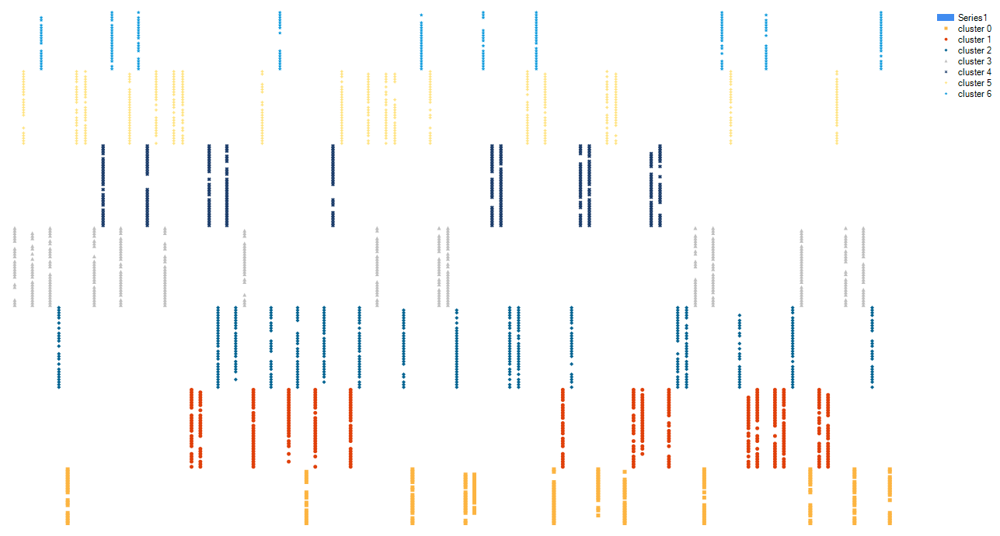
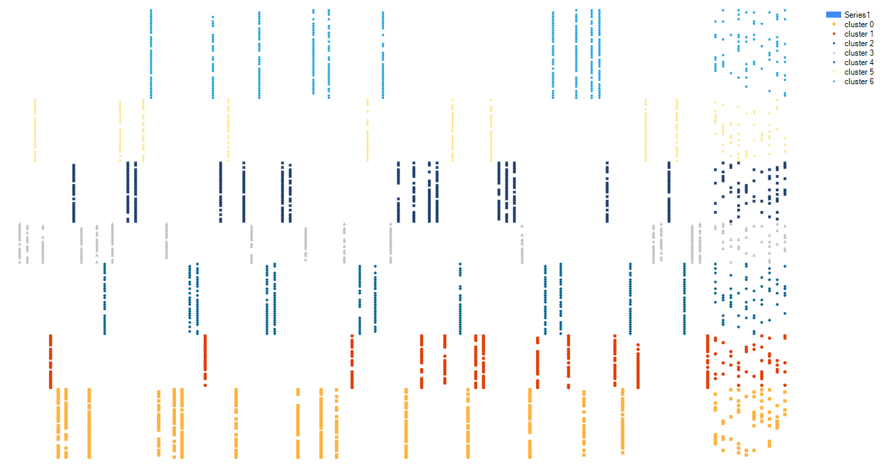
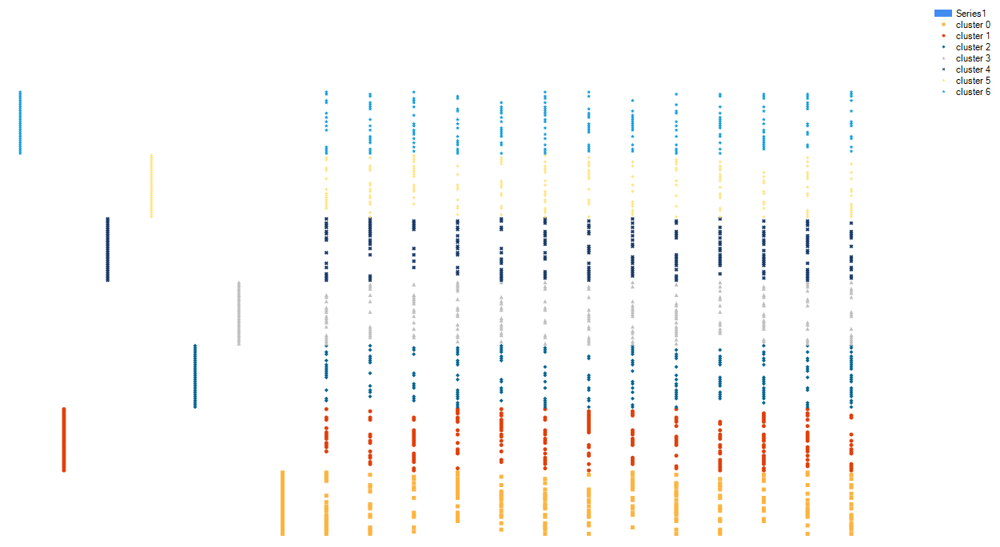
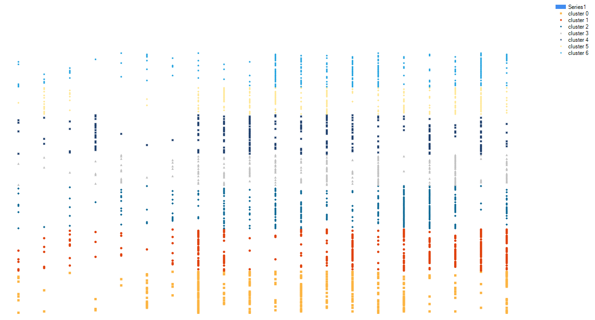

# POPC-examples
Example 1 (clustered by POPC):

Example 2 (clustered by POPC):

Example 3 (clustered by POPC):

Example 3 (clustered by k-means):

Reference:
* P. Taraba: [Powered Outer Probabilistic Clustering](http://www.iaeng.org/publication/WCECS2017/WCECS2017_pp394-398.pdf), Proceedings of the World Congress on Engineering and Computer Science, IAENG, October 2017
